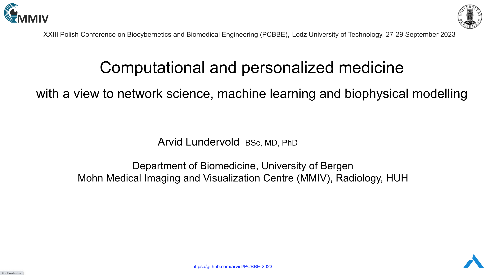

# PCBBE-2023
Accompanying the presentation: "Computational and personalized medicine  with a view to network science, machine learning and biophysical modelling" at the XXIII Polish Conference on Biocybernetics and Biomedical Engineering (PCBBE), Lodz University of Technology, 27-29 September 2023 

**Click for slide presentation:**

[](https://docs.google.com/presentation/d/e/2PACX-1vRu4_-CBwLXvcs5bQJd4MiOIxweltlisrFZiEiwzK3sjvus6KDbMMKifXOYlwzanJYKjusYNRtOStxl/pub?start=false&loop=false&delayms=3000)


Conda environment for Jupyter notebook code (patient similarity networks; biophysical modeling; IBS simulation study)
```bash
conda create --name pcbbe-2023 python=3.9
conda activate pcbbe-2023
conda install ipykernel ipython jupyter
pip install numpy pandas matplotlib
pip install networkx 
pip install seaborn
pip install gower
pip install python-louvain 
pip install collections
pip install plotly==5.17.0
pip install ipywidgets tqdm
pip install SimpleITK nibabel scikit-image scikit-learn nilearn
```

Jypyter notebooks:
- [Patient similarity networks](./code/01-patient-similarity-networks.ipynb) 
- [Tumor growth modeling](./code/02-biophysical-modelling-ucsf-pdgm-0020.ipynb)
- [IBS clinical study simulation](./code/03-ibs-simstudy.ipynb)

  
See also: [PCBBE_2023-PLEN-04-Debate-AL.md](PCBBE_2023-PLEN-04-Debate-AL.md) ("Will AI going to replace a medical doctor?")
